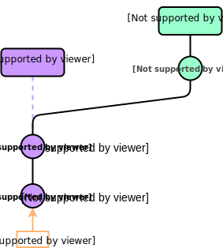
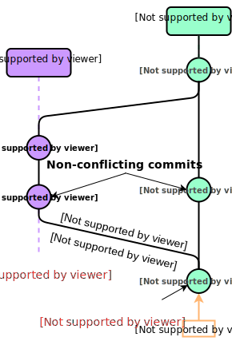
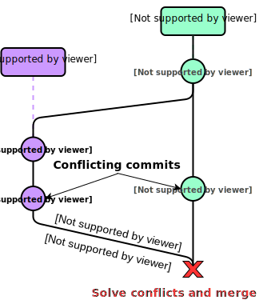

<!-- footer: Python Crash Course 201 - Session 0 -->
<!-- _class: center-content -->
<!-- _backgroundImage: url('https://marp.app/assets/hero-background.jpg') -->


# Git

Version control system

---
<!-- _headingDivider: 1 -->
<!-- paginate: true -->

## What is Git?

* Most widely used version control technology in the world
* Created by Linus Thorvalds
* Free to use 
* Works best for text files, but can be used for other file types

---

## Git repositories

* A project is tracked as a ***Git repository***
* Tracking occurs via a hidden subdirectory called `.git/` inside the root directory
* A Git repository looks like any other directory on your system (except for the presence of `.git/`)

### Common ways to create Git repositories
1. Start tracking an existing *local* project by turning it into a Git repository 

2. `clone` a *remote* Git repository and starting tracking it *locally*  

A common place to host *remote* Git repositories is **GitHub**. 

---

## What is GitHub? 
Most people hear about GitHub before Git, so let's cover that briefly: 

* **GitHub** is a website that hosts Git repositories 

* Provides modern looking interface with many features for collaboration 

* **GitHub** started as a community maintained project and was so for many years 
* Acquired by Microsoft in 2018. 

* Free for basic usage

---

## Some things GitHub makes easy

* **Viewing version history** of projects tracked by Git 
* **Collaborating** on projects for both small and very large teams
* **Showcasing** projects and demonstrating their use 
* **Managing** projects with todo's, issues, milestones, releases etc.

To understand GitHub, one must first have a basic understanding of Git and version control in general.

Let's move on with that :rocket:

---


## So again, what is Git?

* A **distributed version control system**

* **Which means:** 
  Everyone has a local `clone ` of the entire project and its history 

---

## Advantages of Git 
* Fast and light-weight
* Seamless collaborative work
* Work alone when needed and share when needed
* Almost impossible to lose work
* Supports workflows from very simple to very complex

---
<!-- _paginate: false -->
<!-- _class: center-content  -->
<!-- _backgroundImage: url('https://marp.app/assets/hero-background.jpg') -->


# Git Basics

Commands and features

---


## Git commands

Interaction with Git is performed via commands in ***Git Bash***

* Opens from inside your Git repository via right-click menu
* Interact with the repository by typing `git <command_name>`
* Many editors support common commands in GUI form

Initialize a Git repository inside a directory by typing

```css
git init
```
This will create the hidden `.git` folder in the current directory.

---

## Commit
The `git commit` command is the heart of Git.

**Git does the following when `git commit` is executed:**

* Saves your local staged changes to your local Git repository

* Takes a "picture" of what the repository files look like and stores it as a ***snapshot*** 

* Gives the snapsnot an ID so all files can be reverted to that state at *any* time

* Assigns the commit message you specify to snapshot 

Make a `commit` each time you want to record a snapshot of the project state by: 

```css
git commit -m "Commit message goes here"
```

---


## Commits over time
A `commit` records the state of all files, even unchanged ones.

Git creates a pointer to the previous version of unchanged files instead of saving it again.

---

## Status of files

A file in a Git repository can have two states: 

* **Untracked** 
Grey operations
* **Tracked** 
Red operations

---


## Three local states

A file that is **tracked** inside a Git repository can be in three states:

**1. Modified:**
File is modified and Git has detected it
  
**2. Staged**
File is in the staging area ready to be included in the next `commit`

**3. Comitted**
The file has been checked in and Git has taken a snapshot of the repository state

---


## Ignoring files

It's quite common to have things inside a Git repository that you do not want to have version controlled.

The `.gitignore` file inside the repository controls what is being version controlled.

* Examples of files to ignore:

  * Excel files
  * Pictures or graphs
  * Dummy data sets for testing
  * Generated files

---
<!-- _paginate: false -->
<!-- _class: center-content -->
<!-- _backgroundImage: url('https://marp.app/assets/hero-background.jpg') -->


# Branching

The pinnacle of collaboration


---


## Branching illustrated 1/4
Branching is best explained by an example.

**Scenario:**

1. We have a main branch called `master` 
2. We just made a `commit` **C1** which made the code stable and ready for use by others.

The figure to the right depicts the scenario.

> **Note:** `HEAD` is a reference to the currently checked out commit

---


## Branching illustrated 2/4

We want to keep developing and create a new feature.

***But*** we don't want to work directly in `master`. Others are using this branch and developing might temporarily bring it into a broken state. 

3. So we create a new branch called `feature` from Git Bash by typing
```css
git branch feature
```

---


## Branching illustrated 3/4

We have created the branch, but the currently checked out commit (`HEAD`) is still `master`'s **C1**.

4. We switch to the new `feature` branch by
```css
git checkout feature
```
This switched us to the new `feature` branch with the same `commit` **C1** 

---


## Branching illustrated 4/4

Now we want to start making the changes to implement our feature.

5. Change some file(s) and run 
```css
git commit
```

This creates a new `commit` **C2**.

*The **C2** `commit` might have made `master` unstable had it been done on that branch. But we are safe to experiment on our `feature` branch.* 

---
<!-- _paginate: false -->
<!-- _class: center-content -->
<!-- _backgroundImage: url('https://marp.app/assets/hero-background.jpg') -->


# Merging

Integrating changes from a branch

---

## Merging the `feature` branch

*Continuing from the previous branching example.* 

Our work on branch `feature` has been completed by `commit` **C2**. We want to `merge` it back into `master` so other can use it.

**We'll cover three different merging scenarios:**

1. **Automatic merge: Fast-forward** 
Branch `feature` has commits beyond **C1**, but `master` is unchanged at commit **C1**  

2. **Automatic merge: 3-way merge**
Both `feature` and `master` has new commits beyond **C1** which are not conflicting

3. **Merge conflict**
Both `feature` and `master` has new commits beyond **C1** which are  conflicting

---


## Auto merge: Fast-forward

We can seamlessly merge branch `feature` into branch `master` by simply moving `commit` **C2** to `master`. 

This is because `mater` is unchanged since branch `feature` was created. 

```css
git checkout master
git merge feature
```

> **Note:** When doing `git merge <branch_name>`, `HEAD` must be in the branch to `merge` *into*.

---

## Auto merge: 3-way merge

Branch `master` now has a `commit` **C3** after `feature` was created. Thus, both **C2** and **C3** has to be taken into account when merging.

If **C2** and **C3** has ***no competing changes***, Git is smart enough to perform an automatic `merge` by use of those two commits and their common ancestor **C1** (3-way). 

```css
git checkout master
git merge master
```

---

## Merge conflict

Suppose the `commits` **C2** and **C3** has conflicting changes. 

There is is no way for Git to know which change to keep during `merge`.

Thus, ***the user*** must 
1. resolve the `merge conflict` manually 
2. `commit` the changes
3. `merge` again 

---

## Summary: Branching

* Allows us to avoid working on the `master` branch  

* Everybody can work without overwriting work of others

* Work can be grouped logically into a branch for each sub project 

* Use branches for work that's experimental in nature (and might end up discarded)

* A branch creates a pointer to a commit ID (*not* a copy of the file system)

* Creating a branch is cheap ---> it's encouraged to do it often

* Main branch is by default called `master` :exclamation:
 
---

## Summary: Merging

* Allows us to feed work from branches back into the `master` (or other branches)

* Frees us from *a lot* of manual and error prone work 

* Provides a natural step for QA *(more on this when we get to GitHub)*

* A successful `merge` creates a new *merge commit* at the tip of the current branch

* After merging, the branch that was merged in can be deleted

* Basic merging can have three outcomes: 1. Fast-forward, 3-way merge or merge conflict


---
<!-- _paginate: false -->
<!-- _class: center-content -->
<!-- _backgroundImage: url('https://marp.app/assets/hero-background.jpg') -->


# Workflow 

Some examples

---
<!-- _class: center-content -->
## Simple workflow example


---
<!-- _class: center-content -->
## Advanced workflow example (often referred to as Git Flow)


---
<!-- _paginate: false -->
<!-- _class: center-content -->
<!-- _backgroundImage: url('https://marp.app/assets/hero-background.jpg') -->


# Git in VS Code

Simplifying common commands 

---

## Git interface - _Git Bash vs. an editor_
Git Bash (the command line interface) is the original way of working with Git. It contains all the available commands and gives the user more control.

However, **all the popular editors have Git integration build in**, which includes the vast majority of functionality for basic users. It's arguably an easier way to get into the workflow for beginners. 

Visual Studio Code has great Git integration!

---


## Start tracking your own project
You want to create a new project and start tracking it with Git and GitHub. 
In order to do that, we need to have a 

**Git Bash command:**

```css
git init
```
---
<!-- _class: center-content -->
## VS Code Source control tab


---

## Normal workflow demonstrated in VS Code

Once you have a project setup properly with a local Git repository and a remote to push to, the standard workflow will be something like:

___TODO: If real fancy create a gif___

---
<!-- _paginate: false -->
<!-- _class: center-content -->
<!-- _backgroundImage: url('https://marp.app/assets/hero-background.jpg') -->

# Git for non-text files

Not optimal

---

## Binary files

Non-text files are so-called ***binary files*** in Git's eyes.

They can not be mea


---

## Merging of binary files
* Image with two different commits (non-conflicting) each on their own branch

* Easy for humans to visually see how to merge

* File cannot be textually merged

* User must choose one or the other to keep and discard the other

* Excel, word and PowerPoint files have same problems (also binary)  


---

So to sum up:

> Git can version control binary files, but it has some limitations.
> * Git cannot create meaningful ***diffs*** of binary files, which makes it hard to view changes from one commit to the next.  
> * As a consequence, Git cannot automatically ***merge*** two diverged branches, i.e. two branches that were both committed to after they split. In that case it must be manually chosen which branch is the right one to continue with. 

---

Recall that for text files, Git can automatically merge changes for diverged branches provided there are not conflicts. Conflicts occur if the branches to be merged were changed in the exact same place. In the case of a merge conflict with text files, resolving the conflict is done by comparing the two branches. The branches to be merged can easily be compared line by line e.g. in an editor. 

### Why is this not a PowerPoint?
PowerPoints (`.ppt`-flies) are binary

---
<!-- _paginate: false -->
<!-- _class: center-content -->
<!-- _backgroundImage: url('https://marp.app/assets/hero-background.jpg') -->


# Basic commands

And references

---
<!-- _class: small-table-text -->

| Command                  | Description           |
| :----------------------------------- |:-------------|
| ``git init``                       | _Initialize an empty Git repository in the current working directory (create hidden `.git` folder)_ |
| ``git clone <url_to_remote_repo>`` | _Clone an existing remote repository to your machine (E.g. from GitHub)_ |
| ``git add filename``        | _Adds `filename` to staging area ready to be comitted. Add all files by `git add .`_  |
| ``git commit -m "First commit"``  |  _Choose custom commit message if desired_      |
| ``git status``  |  _Show the current status of the repository (untracked, modified and staged files)_      |
| ``git branch branch_name``  |  _Create a branch called `branch_name`_      |
| ``git checkout branch_name``  |  _Checkout (or switch to) the branch called `branch_name`_      |
| ``git checkout -b branch_name``  |  _Create and checkout (or switch to) the branch called `branch_name`_      |

---
<!-- _class: small-table-text -->
| Command                  | Description           |
| :----------------------------------- |:-------------|
| ``git branch``  |  _List all branches with an asterisk `*` at the currently checked out branch_    |
| ``git merge branch_name``  |  _Merge the branch called `branch_name` into the currently checked out branch_      |
| ``touch filename.ext``               | _Create a file `filename` with extension `ext` in current directory. Files can of course also be created by other methods or copied form elsewhere. Note: This is not actually a Git, but a Linux command_      |

---
<!-- _class: small-table-text -->

## References
| Link     | Description      |
| :----| :---- |
| [Ressourcces to learn Git](https://try.github.io/) | _GitHub guides for Git_ |
| [Pro Git](https://git-scm.com/book/en/v2) | _Book on Git written by experts_ |
| [`.gitignore` examples](https://git-scm.com/book/en/v2) | _Good examples of `.gitignore` files for various languages_ |

---
<!-- _paginate: false -->
<!-- _class: center-content -->
<!-- _backgroundImage: url('https://marp.app/assets/hero-background.jpg') -->

# Exercises
Get started with Git for this course

---

## Purpose
The idea for the rest of the course is to integrate Git into all the subsequent session. We'll use Git for version controlling our code for solving the exercises.

By the end of the course we should be pretty familiar with how Git works.

---

## Exercise 1 - One time configurations

Open Git Bash from Windows start menu.

Setup up your global user name and email by typing the commands below.

```css
git config --global user.name "John Doe"
```
```css
git config --global user.email johndoe@example.com
```

This information will be tied to all `commit` actions that you do later on.

Close the Git Bash again.

---

## Exercise 2

Create a new directory to store the contents you produce for this course. Inside that folder in Windows explorer, right-click and select *Git Bash here*.

**Initialize an empty Git repository** inside this directory by

```css
git init
```

You can also do this from VS Code if you want as shown in the slides above.

*Recall that this creates a hidden directory called `.git`, which will store all metadata about the project's version history.*  

---

## Exercise 3

You probably want to store some files in the Git repository that you don't want to version control. 

**Create a `.gitignore` file** by typing
```css
touch .gitignore
```
Put the files and folder you want to ignore inside it. Use the example file from the slide about ignoring files as basis.

---

## Exercise 4


Markdown is a simple way to create good looking text documents. It's often used for introducing projects in a `README.md` file, which is shown on GitHub. 

See a guide for markdown [here](https://github.com/adam-p/markdown-here/wiki/Markdown-Cheatsheet).

**Create a markdown file `README.md` in the root directory** and write something in it. E.g. explain what the purpose of the repository. ***TODO: DON'T WRITE SOMETHING BEFORE COMITTING, THE CHANGES SHOULD BE THE COMMIT!!!***

You can either create the file by the `touch` command or manually, e.g. via the editor. 

---


## Exercise 5

Now you have created two files and modified them. Git has tracked this.

### VS Code

If you are using VS Code, check the Source Control tab on the left pane. The CHANGES tab will reveal all modified files that are not ignored via `.gitignore`.

However, **the files are not yet under version control**. The green **U** denotes that the files are *untracked*. They need to be explicitly added to Git.


---
### Git Bash

If you are using Git Bash, you can get the same information by typing 
```css
git status
```
See the entire history of what we did so far in the image.

---

Stage `README.md` to get it ready to go into the next `commit`
```css
git add README.md
```


Add the two files

 
---

## Exercise 5

3. Write a message and `commit` the changes
```css
git commit -m "First commit"
```


Recall that a `commit` creates a *snapshot* of the state of the repository. It *locks* in the changes. This points can be reverted to at any time.


