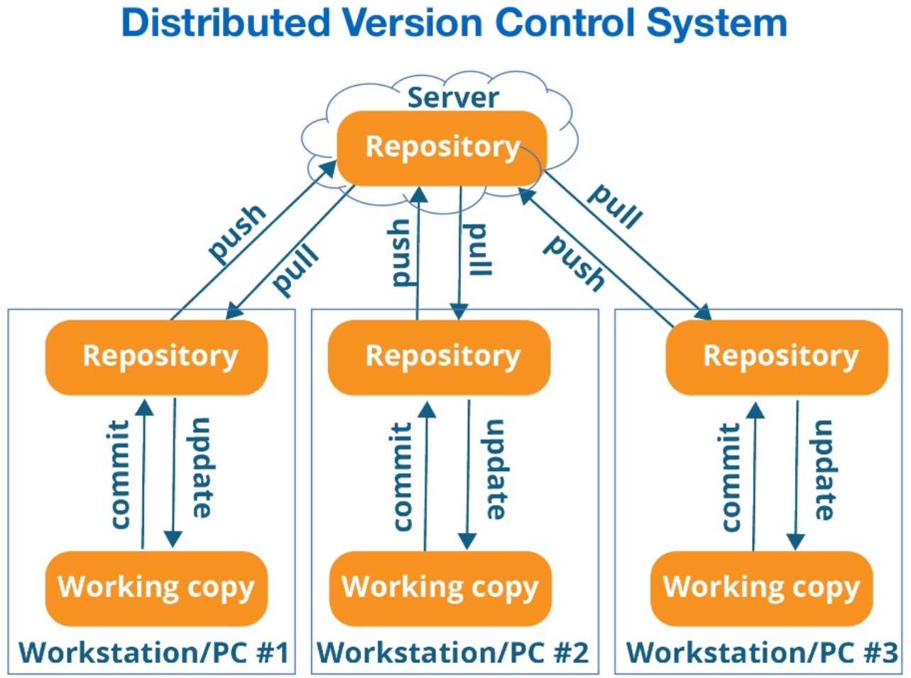
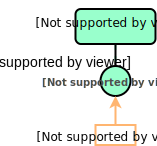
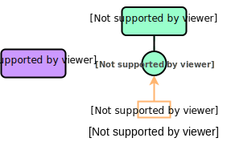
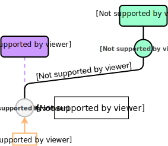
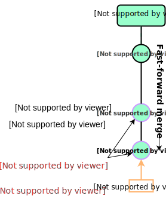

# Git


## What is Git?

- Most widely used version control technology in the world
- Created by Linus Thorvalds (creator of Linux, Android ...)
- Free and open-source
- Works best for text files, but can be used for other file types

## Git repositories

- A project is tracked as a ***Git repository***
- Tracking occurs via a hidden subdirectory called `.git/` inside the root directory
- A Git repository looks like any other directory on your system (except for the presence of `.git/`)

### Common ways to create Git repositories

1. Start tracking an existing *local* project by turning it into a Git repository

2. `clone` a *remote* Git repository and start tracking it *locally*

A common place to host *remote* Git repositories is **GitHub**.

## What is GitHub?

Most people hear about GitHub before Git, so let's cover that briefly:

- **GitHub** is a website that hosts Git repositories

- Provides modern looking interface with many features for collaboration

- **GitHub** started as a community maintained project and was so for many years
- Acquired by Microsoft in 2018

- Free for basic usage

- Largest open-source platform in the world (incl. [Python](https://github.com/python))

## Some things GitHub makes easy

- **Viewing version history** of projects tracked by Git
- **Collaborating** on projects for both small and very large teams
- **Showcasing** projects and demonstrating their use
- **Managing** projects with to-do's, issues, milestones, releases etc.

To understand GitHub, one must first have a basic understanding of Git and version control in general.

Let's move on with that :rocket:

## So again, what is Git?

- A **distributed version control system**

- **Which means:**
  Everyone has a local `clone` of the entire project and its history



## Advantages of Git

- Fast and light-weight
- Seamless collaborative work (no check-in/out locks)
- Work alone when needed and share when needed
- Almost impossible to lose work
- Support workflows from very simple to very complex

# Git Basics

## Git commands

Interaction with Git is performed via commands in ***Git Bash***

- Opens from inside your Git repository via right-click menu
- Interact with the repository by typing `git <command_name>`
- Many editors support common commands in GUI form

Initialize a Git repository inside a directory by typing

```markdown
git init
```


This will create the hidden `.git` folder in the current directory.

## Commit

The `git commit` command is the heart of Git.

**Git does the following when `git commit` is executed:**

- Saves your local staged changes to your local Git repository

- Takes a "picture" of what the repository files look like and stores it as a ***snapshot***

- Gives the snapshot an ID so all files can be reverted to that state at *any* time

- Assigns the commit message you specify to snapshot

Make a `commit` each time you want to record a snapshot of the project state by:

```markdown
git commit -m "Commit message goes here"
```

## Commits over time

A `commit` records the state of all files, even unchanged ones.

Git uses pointers instead of duplicating unchanged files.


## Status of files

A file in a Git repository can have two states:

- **Untracked**
Grey operations
- **Tracked**
Red operations


## Three local states

A file that is **tracked** inside a Git repository can be in three states:

**1. Modified:**
File is modified and Git has detected it

**2. Staged**
File is in the staging area ready to be included in the next `commit`

**3. Committed**
The file has been checked in and Git has taken a snapshot of the repository state


## Ignoring files

It's quite common to have things inside a Git repository that you do not want to have version controlled.

The `.gitignore` file inside the repository controls what is being version controlled.

- Examples of files to ignore:

  - Excel files
  - Pictures or graphs
  - Dummy data sets for testing
  - Generated files


# Branching

## Branching illustrated 1/4

Branching is best explained by an example.

**Scenario:**

1. We have a main branch called `master`
2. We just made a `commit` **C1** which made the code stable and ready for use by others.

The figure to the right depicts the scenario.

> **Note:** `HEAD` is a reference to the currently checked out commit



## Branching illustrated 2/4

We want to keep developing and create a new feature.

***But*** we don't want to work directly in `master`. Others are using this branch and developing might temporarily bring it into a broken state.

3. So we create a new branch called `feature` from Git Bash by typing

```markdown
git branch feature
```



## Branching illustrated 3/4

We have created the branch, but the currently checked out commit (`HEAD`) is still `master`'s **C1**.

4. We switch to the new `feature` branch by

```markdown
git checkout feature
```

This switched us to the new `feature` branch with the same `commit` **C1**



## Branching illustrated 4/4

Now we want to start making the changes to implement our feature.

5. We make changes over two commits via

```markdown
git commit
```

This creates `commits` **C2** and **C3**.

***C2** and **C3** might have made `master` unstable had it been done on that branch. But we are safe to experiment on our `feature` branch.*


# Merging

## Merging the `feature` branch

*Continuing from the previous branching example.*

Our work on branch `feature` has been completed by `commit` **C3**. We want to `merge` it back into `master` so other can use it.

**We'll cover three different merging scenarios:**

1. **Automatic merge: Fast-forward**
Branch `feature` has commits beyond **C1**, but `master` is unchanged at commit **C1**

2. **Automatic merge: 3-way merge**
Both `feature` and `master` has new commits beyond **C1** which are not conflicting

3. **Merge conflict**
Both `feature` and `master` has new commits beyond **C1** which are  conflicting

## Auto merge: Fast-forward

We can seamlessly merge branch `feature` into branch `master` by simply moving **C2** and **C3** to `master`.

This is because `mater` is unchanged since branch `feature` was created. *The history is linear.*

```markdown
git checkout master
git merge feature
```

> **Note:** When doing `git merge <branch_name>`, `HEAD` must be in the branch to `merge` *into*.



## Auto merge: 3-way merge

Branch `master` now has a `commit` **C3** after `feature` was created. Thus, both **C2** and **C3** has to be taken into account when merging.

If **C2** and **C3** has ***no competing changes***, Git is smart enough to perform an automatic `merge` by use of those two commits and their common ancestor **C1** (3-way).

```markdown
git checkout master
git merge feature
```


## Merge conflict

Suppose the `commits` **C3** and **C4** has conflicting changes.

There's no way for Git to know which change to keep during `merge`.

Thus, **the user** must

1. resolve the `merge conflict` manually
2. `commit` the changes
3. `merge` again

Merge conflicts can be resolved in the editor.


## Summary: Branching

- Allows us to avoid working on the `master` branch

- Everybody can work without overwriting work of others

- Work can be grouped logically into a branch for each sub project

- Use branches for work that's experimental in nature (and might end up discarded)

- A branch creates a pointer to a commit ID (*not* a copy of the file system)

- Creating a branch is cheap ---> it's encouraged to do it often

- Main branch is by default called `master` :exclamation:

## Summary: Merging

- Allows us to feed work from branches back into the `master` (or other branches)

- Frees us from *a lot* of manual and error prone work

- Provides a natural step for QA *(more on this when we get to GitHub)*

- A successful `merge` creates a new *merge commit* at the tip of the current branch

- After merging, the branch that was merged in can be deleted

- Basic merging can have three outcomes: 1. Fast-forward, 3-way merge or merge conflict

# Workflow

## Simple workflow example


## Advanced workflow example (often referred to as Git Flow)


# Git in VS Code

## Git interface - _Git Bash vs. an editor_

Git Bash (the command line interface) is the original way of working with Git. It contains all the available commands and gives the user more control.

However, **all the popular editors have Git integration build in**, which includes the vast majority of functionality for basic users. It's arguably an easier way to get into the workflow for beginners.

Visual Studio Code has great Git integration!

## Start tracking your own project

You want to create a new project and start tracking it with Git and GitHub.
We can initialize a repository as shown below.

**Git Bash command:**

```markdown
git init
```

From VS Code the same operation looks like this:


## VS Code - Source control tab


# Git for non-text files

## Binary files

- Non-text files are so-called **binary files** in Git's eyes.

- They can not be meaningfully compared from commit to commit.

This creates a problem for merging, since the merging algorithm needs to compare the tip commit on the two branches to be merged with their common ancestor commit. When the difference between the commits can't be determined, merging always results in a conflict. **You need to retain one branch or the other**.

## Merging of binary files

- Image with two different commits (non-conflicting) each on their own branch

- Easy for humans to visually see how to merge

- File cannot be textually merged

- User must choose one or the other to keep and discard the other

- Excel, word and PowerPoint files are also binary


## Summary

Git can version control binary files, but it has some limitations.

- Git cannot create meaningful **diffs** of binary files, which makes it hard to view changes from one commit to the next.
- As a consequence, Git cannot automatically **merge** two diverged branches, i.e. two branches that were both committed to after they split. In that case it must be manually chosen which branch is the right one to continue with.

# Basic commands

| Command                  | Description           |
| :----------------------------------- |:-------------|
| ``git init``                       | _Initialize an empty Git repository in the current working directory (create hidden `.git` folder)_ |
| ``git clone <url_to_remote_repo>`` | _Clone an existing remote repository to your machine (E.g. from GitHub)_ |
| ``git add filename``        | _Adds `filename` to staging area ready to be committed. Add all files by `git add .`_  |
| ``git commit -m "First commit"``  |  _Choose custom commit message if desired_      |
| ``git status``  |  _Show the current status of the repository (untracked, modified and staged files)_      |
| ``git branch branch_name``  |  _Create a branch called `branch_name`_      |
| ``git checkout branch_name``  |  _Checkout (or switch to) the branch called `branch_name`_      |
| ``git checkout -b branch_name``  |  _Create and checkout (or switch to) the branch called `branch_name`_      |
| ``git branch``  |  _List all branches (shows an asterisk `*` at the currently checked out branch_    |
| ``git merge branch_name``  |  _Merge the branch called `branch_name` into the currently checked out branch_      |
| ``touch filename.ext``               | _Create a file `filename` with extension `ext` in current directory. Files can of course also be created by other methods or copied form elsewhere. Note: This is not actually a Git, but a Linux command_      |

## References

| Link     | Description      |
| :----| :---- |
| [Resources to learn Git](https://try.github.io/) | _GitHub guides for Git_ |
| [GitHub For Beginners: Don’t Get Scared, Get Started](https://readwrite.com/2013/09/30/understanding-github-a-journey-for-beginners-part-1/) | _Article on Git and GitHub (nicely explained)_ |
| [Pro Git](https://git-scm.com/book/en/v2) | _Book on Git written by experts_ |
| [`.gitignore` examples](https://git-scm.com/book/en/v2) | _Good examples of `.gitignore` files for various languages_ |

# Exercises

## Purpose

The idea for the rest of the course is to integrate Git into all the subsequent sessions. We'll use Git for version controlling our code when solving the exercises.

By the end of the course we should be pretty familiar with how Git works and feel comfortable using it going forward.

If you haven't installed Git yet you can do so from [here](https://git-scm.com/downloads).

## Exercise 1 - One time configurations

Open Git Bash and check out your settings by `git config --list`.

If needed, setup your global user name and email by typing the commands below.

```markdown
git config --global user.name "John Doe"
```

```markdown
git config --global user.email johndoe@cowi.com
```

This user information will be tied to all `commit` actions that you do later on.

## Exercise 2

Create a new directory to store the contents you produce for this course. Inside that folder in Windows explorer, right-click and select *Git Bash here*.

**Initialize an empty Git repository** inside this directory by

```markdown
git init
```

You can also do this from VS Code, as shown in the previously, if you want.

*Recall that initializing a repository creates a hidden directory called `.git`, which will store all metadata about the project's version history.*

## Exercise 3

You probably want to store some files in the Git repository that you don't want to version control.

**Create a `.gitignore` file** by typing

```markdown
touch .gitignore
```

Leave it empty for now.

## Exercise 4

Markdown is a way to create simple and good looking text documents. It's often used for introducing projects in a `README.md` file, which is shown on GitHub.

**Create a markdown file `README.md` in the root directory**. Leave it empty for now.

You can either create the file by the `touch` command or manually, e.g. via the editor.

## Exercise 5

Now you have created two files and modified them, and Git has spotted this.

### VS Code view

If you are using VS Code, check the Source Control tab on the left pane. The CHANGES tab will reveal all modified files that are not ignored via `.gitignore`.


However, **the files are not yet under version control**. The green **U** denotes that the files are *untracked*. They need to be explicitly added to Git.

### Git Bash view

If you are using Git Bash, you can get the same information by typing

```markdown
git status
```

See the entire history of what we did so far in the image.


**Stage the files `README.md` and `.gitignore`** to get them ready to go into the next `commit`.

1. You click the `+` button in VS Code to `add` files to the staging area (hoover the mouse over the specific files)
2. Equivalent commands in Git Bash is

```css
git add README.md .gitignore
```

You can also stage **all** files by

```markdown
git add .
```

## Exercise 6

Now the new files are in the staging area ready to be committed.

**Write a message and `commit` it:**

```css
git commit -m "First commit"
```

In VS Code, this is done by writing the message in the box at the top left of the Source Control tab and pressing the check mark sign to `commit` it.

Recall that a `commit` creates a **snapshot** of the state of the repository. It **locks** in the changes. This points can be reverted to or branched out from at any time.

## Exercise 7

**Open the `.gitignore` file and put the files and folders you want Git to ignore inside it**. Use the example file shown previously about ignoring files as basis.

If you are using VS Code you should see the Source Control tab update to `.gitignore` to now be *modified* since last commit.

When you are satisfied with the `.gitignore` file, `stage` the changes and `commit` the file with a fitting message.

## Exercise 8

All previous exercises have been dealing with the `master` branch. When `git init` is executed, the repo starts out with only that branch.

**Create a branch called `readme`**

```css
git branch readme
```

**And switch from the `master` branch to  the `readme` branch**

```css
git checkout readme
```

> **Note 1:** These steps can be done in one go by `git checkout -b readme`
> **Note 2:** You can also do this directly from VS Code from the bottom left corner where the current branch is shown

## Exercise 9

In VS Code you can see that the current branch changed to `readme`. In Git Bash you can get the same info by running `git branch`.

**Open the markdown file `README.md` and write something in it.**
A README is often used in repositories on GitHub to explain what the repository is and how it can be used. You could put a text that explains the purpose of your repository.

See a guide for writing markdown [here](https://github.com/adam-p/markdown-here/wiki/Markdown-Cheatsheet).

**When you reach a state you want to record, `stage` the changes and `commit` with a message.**

Make as many commits as you desire. Keep commits in logical chunks and write concise and clear messages.

## Exercise 10

You have now done a number of commits on the `readme` branch. Suppose you are done working with it for now. It's time to `merge` the changes into `master`.

Recall that merging has to be done from the branch that is to be merged *into*.

**Checkout the `master` branch**

```markdown
git checkout master
```

**And merge the `readme` branch into it**

```markdown
git merge readme
```

> Question: What kind of merge operation will be applied in this scenario?

Check how `README.md` looks in `master` now. The changes you did in the `readme` branch should now be part of `master`.

Since the `merge` is complete and `master` now contains all work in `readme`, it's safe to delete the `readme` branch. You can do so by `git branch -d readme`.

## Recap - Diagram of exercise flow

The following tries to depict the workflow of solving the above exercises.

Commands are written for reference.

The diagrams represent the situation **after** the commands are executed.

Commit messages are written next to each commit.

The diagrams starts from Exercise 6, as that is where the first `commit` happens.

## Exercise 6 - diagram

```markdown
git commit -m "First commit"
```


## Exercise 7 - diagram

```markdown
git commit -m
"Add files to gitignore"
```


## Exercise 8 - diagram

```markdown
git branch readme
```

```markdown
git checkout readme
```

Alternatively in a single command

```markdown
git checkout -b readme
```


## Exercise 9 - diagram

```markdown
git commit -m
"Add title and
short description"
```

```markdown
git commit -m
"Add description
for Session 0"
```

```markdown
git commit -m
"Add location and dates
for course to intro text"
```


## Exercise 10 - diagram

Switch to `master` to `merge` into it

```markdown
git checkout master
```

```markdown
git merge readme
```

Fast-forward `merge` as branches have not diverged.


## Exercise 10 - diagram (cont.)

Alternative `merge` without fast-forward

```markdown
git merge --no-ff readme
```

Creates a new `merge commit` on `master`.

