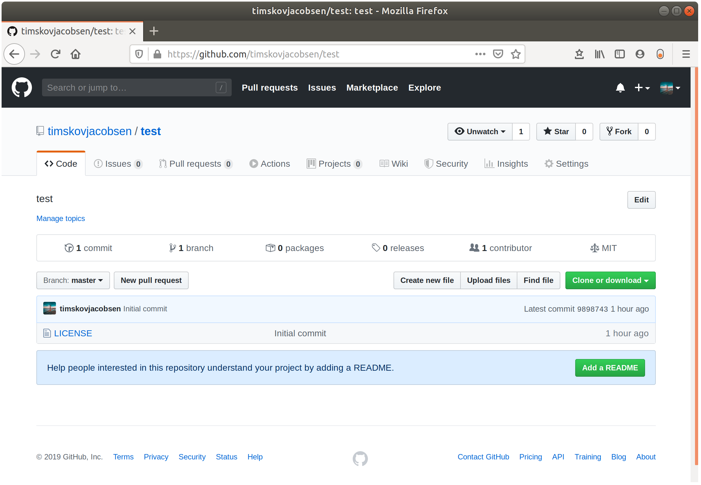

# GitHub

<***Placeholder for GitHub image***>

## Recap form Session 1

GitHub is a website that hosts Git repositories.

<***Placeholder for recap***>

## Remotes - sharing work

Up until now we have only talked about local operations. I.e. operations where each person works alone on a local machine.

## GitHub features and remote nomenclature

### Pull Request

<***Placeholder for description***>

### Issues

<***Placeholder for description***>

### ```push```

<***Placeholder for description***>

```markdown
git push
```

### `clone`

With Git, you can `clone` a remote repository to your local machine and start version controlling it by

```markdown
git clone <url_to_remote_repo>
```

### Forking

**Imagine this scenario:** You see a cool project on GitHub that you are interested in. You would like to access the code to play around with it yourself, maybe you want to use it as basis for your own project. ***But***, you don't want to affect the existing project.

You could `clone` the repository and do some changes locally, but where do you go from there? A `push` to the remote repo would affect the existing project, which is not what you want.

This is where **Forking** comes in. **Forking** a repository means to copy it to your own remote repository. You can now `clone` your own repository and `push` without affecting the existing one that you forked from.

This does not hinder the possibility of merging your new code into the existing project though. You can submit a *Pull Request* from your own repository to let the maintainer know that you have a potential contribution.
This is a common way to contribute to projects where you are not part of the "core team". If you see a bug, you can fix it yourself this way if you're up for it.

*See more about forking [here](https://help.github.com/en/github/getting-started-with-github/fork-a-repo).*

### `origin`

**The *main* remote repository is called `origin`.**

When you connect your local repository to a remote one, it's standard to name the remote one `origin`. If you `clone` a project from an url, Git will automatically set the name of the remote repository to `origin`.

`origin` is the default name for a main remote repository just as `master` is the default name for the main branch.
It's possible (but not common) to rename the main remote to something else, just like `master` can be renamed.

You can have more than one remote repository. An example of this could be when *forking* a project. You will have your own fork as the *main* remote repository, i.e. `origin`. The existing project that you forked from could be called `upstream`.

### `origin/master`

**The `master` branch in the remote repository is called `origin/master`.**

You have an `origin/master` on your local machine. This a branch that is ***read-only***. You can't write directly to a remote repository. It's a so-called *bare repository*, which has no working tree (editable files). Changes have to be done locally and `pushed` to the remote.

This implies that if you checkout `origin/master`, or any other remote branch for that matter, you will be in ***detached head*** state. *Detached head* means that what's currently checked out is not a local branch.  

Other branches in the remote repository will have the name `origin/branch_name`

## Visualizing a two-person workflow

The diagrams below try to depict how a two-person workflow might be.

### Step 0

The situation starts with **Person A**, **Person B** and a **Remote Repository** all having completely synced history in the form of a single commit **C1**.

The remote repository could be located on GitHub.


### Step 1

**Person A** starts working and creates `commit` **C2**.


### Step 2

**Person A** wants to share the new work and makes a `push` to update the remote repository with the changes in **C2**.

As the local branch `origin/master` is tracking the remote `master`, it is updated too by the `push`.


### Step 3

**Person B** wants to see **Person A**'s changes and incorporate them into his/her own work. This is done by a `pull` operation, which updates the local `master` so it now includes **C2**.


### Step 4

**Person B** continues working and creates `commit` **C3** and **C4**.


### Step 5

**Person B** performs a `push` of the **C3** and **C4** changes and updates the remote repository.


### Step 6

**Person A** wants to see what **Person B** has been working on, but doesn't necessarily want to incorporate the changes right away. The changes since last communication with the remote server can be downloaded to the local `origin/master` *without* a `merge` them directly into the working copy of `master`.

This operation is called `fetch`.

Doing a `fetch` in this scenario updates **Person A**'s `origin/master` with commits **C3** and **C4**.


### Step 7

**Person A** decides that the local working copy of `master` can be updated with the commits **C3** and **C4**.

The update is done via a standard `merge` operation, same as we did in the previous session.

Thus, **Person A** wants to merge `origin/master` into `master`.

Recall that when merging, the currently checked out branch is the one that is merged *into*. So **Person A** must make sure to have `master` checked out, after which the `merge` can be done as `git merge origin/master`.


### Comments to the above workflow

* The above flow shows each person working "in turn" and then syncing to get the changes from the other person. In fact, **Person A** and **Person B** could be working simultaneously.

  If they have diverged history and **Person A** pushes to remote, then a potential `push` *or* `pull` from **Person B** might lead two either an automatic 3-way `merge` or a `merge conflict`. In the case of an automatic `merge` there is no problem, but in case of a `merge conflict` it is up to **Person B** to resolve the conflict and then finish the `push`/`pull`.

* Note that the commits to each persons local working copy of `master` could be in the form of a `merge` from a local branch. In fact, it's encouraged to work on a branch and then `merge` to `master` when it's done. This opposed to work directly on `master`. Choose what feels right in the situation.

  Local branches are not depicted in the flow above to make visualizations simpler.

## Exercises

Before starting these exercises, you should have a ***local Git repository*** created for version controlling the contents this we develop for this course.
If you don't have that yet, please do the [Session 1 exercises](https://github.com/Python-Crash-Course/Python201/blob/master/Session%200%20-%20Git/session0_git.md#exercises) before starting these.

## Exercise 1

***Create a GitHub account***

Go to [github.com](https://github.com/) and create an account if you don't already have one and log in.

## Exercise 2

***Create a remote repository***

1. Once logged in, go to the `+` sign in the upper right corner and choose *New repository*.

2. Give your repository a name and a description.

3. Choose whether you want your repository to be public or private.

4. We have already created a `README.md` and a `.gitignore` file in the Session 0 exercises, so don't check those boxes. If you'd like, you can add a licence to the repository to let people know under which circumstances they can use your code.

5. Click *Create repository*.

> There is an info icon if you are more curious which license to choose for your repository. If you want to add one but don't care which, just take MIT License. It's the most permissive one.

## Exercise 3

***Sync local repository with GitHub***

You should now see a clean repository that looks something like this



You will now `push` your local code this remote repository.

1. Click the green *Clone or download* button and copy the url.

2. Run `git remote add origin <url>`

   In VS Code, press <kbd>CTRL</kbd>+<kbd>SHIFT</kbd>+<kbd>P</kbd> and type "*Remote*". Choose *Add remote* and supply the url to your remote GitHub repository.

3. Run `git push -u origin master`

   This pushes you local changes to the remote `master` branch on GitHub and creates a link between your local `master` and the `master` on GitHub.
   Thus, subsequent pushes can be done as just `git push` as Git will now know which remote branch to update.
   If you run `git push` without having the link set up beforehand, Git will say something like "*The current branch has no upstream branch*" and ask you to create it before (or while) pushing.

If this succeeded you should now see the GitHub updated repository.

***

**Note:** If you created the GitHub repository with a license file `git push - origin master` will fail and say *Updates were rejected because the tip of your current branch is behind it's remote counterpart*. In other words, the GitHub repository has work that you don't have locally. In this case the license file.

Then it asks you to `pull` down the changes from GitHub to get them merged into your local work. When  that's done, you can `push`. The reason that this is happening is that a `push` can only happen automatically if the `merge` into the remote is of type *fast-forward*. By creating the license file on GitHub the remote `master` and the local `master` have diverged.

To solve this, `pull` the changes down like this:

```markdown
git pull origin master --allow-unrelated-histories
```

Git will open your editor and ask you to do the `merge commit` with a message.

The `git push` can now do a *fast-forward* merge with the GitHub remote because the local work contains all the work that is on GitHub plus som additional work.

Afterwards, you should be able to run `git push -u origin master` and see your updated GitHub repository.

The `--allow-unrelated-histories` flag will not be necessary for pulling next time, since the histories of the local and remote are now *related*.

***Your remote repository on GitHub is now ready for you to continuously `push` work during the next remaining sessions of the course.***

## Exercise 4

***GitHub Learning Lab***

The best way get familiar with GitHub is to use it directly. They have a Learning Lab with some nice interactive tutorials.

A good place to start is at [First Day on GitHub](https://lab.github.com/githubtraining/paths/first-day-on-github).

Be sure to watch the video in *What is GitHub* and to take the interactive tutorial called *Introduction to GitHub*, which will guide you through many of the core features.
