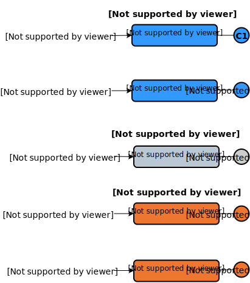
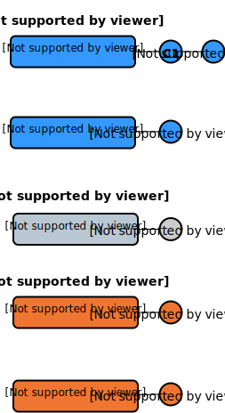
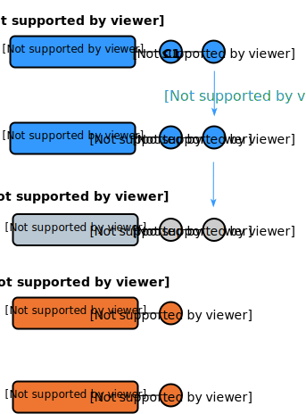
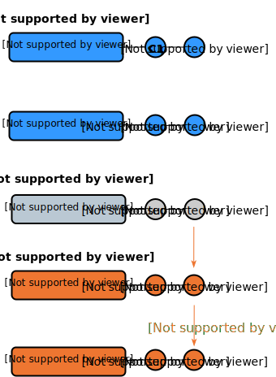
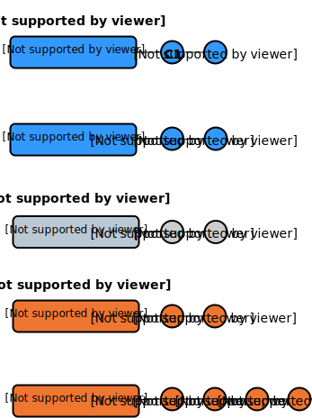
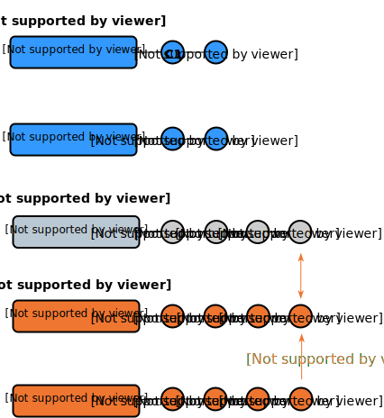
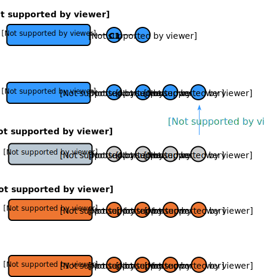
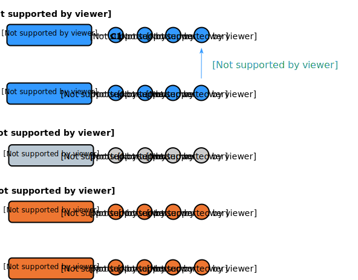
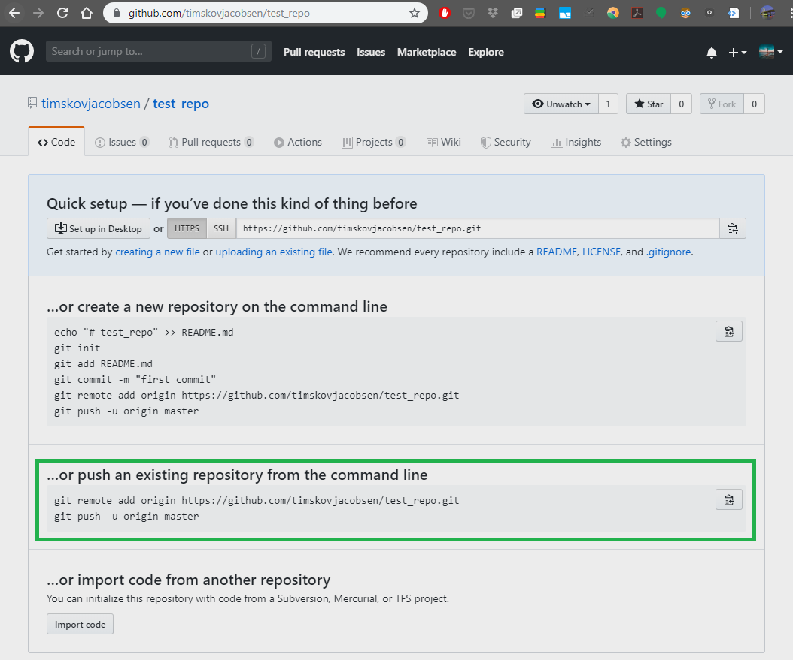
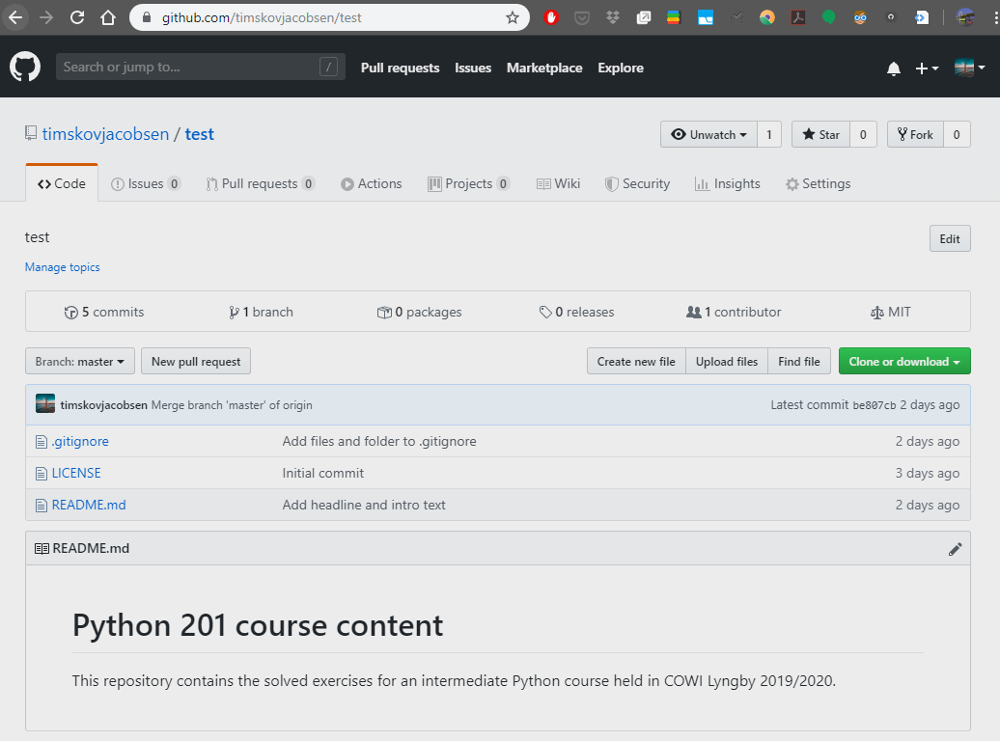

## Git Recap

Last time we talked about the general idea behind Git and how we work on local repositories.

We learned how to initiate a new local repository using the `git init` command, how to see the see the current status with `git status`, how to stage changes with `git add` and finally commit them with the `git commit -m "<message>"` command. The last two commands can even be merged into one `git commit -am "<message>"`.

We can see the commit history with `git log --oneline` and move the HEAD to previous commits with  `git checkout <sha>`, where `<sha>` is a so-called *hash* value. Think of it as an ID-number associated with each commit. We can also checkout other branches with `git checkout <branch>`).

We can create a new branch from HEAD with `git branch <new-branch-name>` and then move HEAD to the new branch with `git checkout <branch>` or combine these two commands with `git checkout -b <new-branch-name>`.
The `git branch` command can also be used to see an overview of the current branches with HEAD'ed branch shown with a **"\*"**.

Finally we talked about how we can merge a given branch into HEAD with `git merge <branch>` and then delete the branch with `git branch -d <branch>`

# Remote Repositories

<!-- GitHub  and Octocat image -->
<p float="middle">
  
  
</p>

GitHub is a website that hosts Git repositories.
It was founded in 2008 and was in 2018 acquired by Microsoft. It now have more than 40 million people working on over 100 million projects!

Up until now we have only talked about local repositories. I.e. operations where each person works against a locally accessible repository. Note that a local repository can be used by several people if stored on a shared network drive, Dropbox/OneDrive folder etc.

Now we will talk about how to use remote repositories for collaboration and/or sharing work.

We use a remote GitHub repository as the example here but it's not different than working against a remote repository on a private on-premise Git server used by many companies.

## Remote add or Clone

There are two ways to get started:

- If you already got a local Git repository you can connect it to a remote repository using `git remote add origin <url_to_remote_repo>`, where `origin` is the default name convention used to represent the remote repository the repository originate from.
- Alternatively, you can create a local repository by cloning a remote repository with `git clone <url_to_remote_repo>`.

## origin

**The *main* remote repository is called `origin`.**

When you connect your local repository to a remote one, it's standard to name the remote one `origin`. If you `clone` a project from an url, Git will automatically set the name of the remote repository to `origin`.

`origin` is the default name for a main remote repository just as `master` is the default name for the main branch.
It's possible (but not common) to rename the main remote to something else, just like `master` can be renamed.

You can have more than one remote repository. An example of this could be when *forking* a project. You will have your own fork as the *main* remote repository, i.e. `origin`. The existing project that you forked from could be called `upstream`.

## Push and Pull

Once a remote connection is established the `git pull origin <branch>` command can be used to pull all the latest commits from "branch" on origin into HEAD. I.e. merging a remote branch into HEAD.

On the other hand, if commits have been made to the local repository they can be pushed to the origin with `git push origin <branch>`, where "branch" is the remote branch you want to push HEAD into. This is similar to merging HEAD into a remote branch.

## Pull Request

For remote repositories where you don't have push access, you instead file a pull request. I.e. you request the project maintainer to pull a branch from your shared repository into the his repository.
The typical workflow is:

1. Clone the official remote repository e.g. from Github
2. Implement a feature in a dedicated local branch
3. Push the branch to a shared/public forked repository e.g. on GitHub
4. File a pull request via e.g. GitHub
5. The pull request goes through official code review with possible discussions and alterations.
6. Project maintainer merges it into the official repository and/or closes the pull request

Pull Requests can also be used even if you already have push access as part of the QA process. One maintainer can submit a Pull Request to another maintainer to get the new code reviewed.

## origin/master

**The local branch `origin/master` is a cached version of the remote branch `master`.**

You have an `origin/master` on your local machine. This is a ***read-only*** branch that You can't commit to. It's a so-called *bare repository*, which has no working tree (editable files). The `get fetch origin <branch>` command can be used to update this cached version of the remote (the pull operation is actually just a fetch followed by a merge).

This implies that if you checkout `origin/master` you will be in ***detached head*** state. *Detached head* means that you're currently checking out a specific snapshot in the commit history away from any of the branches.
Branches can be initiated from this state but commits should generally not be made here as they would be outside the context of a branch and thereby easily lost.

Other remote branches would generate similar local bare repositories named `origin/<branch>`.

## Forking

**Imagine this scenario:** You see a cool project on GitHub that you are interested in. You would like to access the code to play around with it yourself, maybe you want to use it as basis for your own project. ***But***, you don't want to affect the existing project.

You could `clone` the repository and do some changes locally, but where do you go from there? A `push` to the remote repo would affect the existing project, which is not what you want.

This is where **Forking** comes in. **Forking** a repository means to copy it to your own remote repository. You can now `clone` your own remote repository and `push` without affecting the original one that you forked from.

This does not hinder the possibility of merging your code changes into the original project though. You can submit a *Pull Request* from your own remote repository to let the maintainer know that you have a potential contribution.
This is a common way to contribute to projects where you are not part of the "core team". If you see a bug, you can fix it yourself this way if you're up for it.

*See more about forking [here](https://help.github.com/en/github/getting-started-with-github/fork-a-repo).*

## Visualizing a two-person workflow

The diagrams below try to depict how a two-person workflow might be.

### Step 0

The situation starts with **Person A**, **Person B** and a **Remote Repository** all having completely synced history in the form of a single commit **C1**.

The remote repository could be located on GitHub.



### Step 1

**Person A** starts working and creates `commit` **C2**.



### Step 2

**Person A** wants to share the new work and makes a `push` to update the remote repository with the changes in **C2**.

As the local branch `origin/master` is tracking the remote `master`, it is updated too by the `push`.



### Step 3

**Person B** wants to see **Person A**'s changes and incorporate them into his/her own work. This is done by a `pull` operation, which updates the local `master` so it now includes **C2**.



### Step 4

**Person B** continues working and creates `commit` **C3** and **C4**.



### Step 5

**Person B** performs a `push` of the **C3** and **C4** changes and updates the remote repository.



### Step 6

**Person A** wants to see what **Person B** has been working on, but doesn't necessarily want to incorporate the changes right away. The changes since last communication with the remote server can be downloaded to the local `origin/master` *without* a `merge` them directly into the working copy of `master`.

This operation is called `fetch`.

Doing a `fetch` in this scenario updates **Person A**'s `origin/master` with commits **C3** and **C4**.



### Step 7

**Person A** decides that the local working copy of `master` can be updated with the commits **C3** and **C4**.

The update is done via a standard `merge` operation, same as we did in the previous session.

Thus, **Person A** wants to merge `origin/master` into `master`.

Recall that when merging, the currently checked out branch is the one that is merged *into*. So **Person A** must make sure to have `master` checked out, after which the `merge` can be done as `git merge origin/master`.



### Comments to the above workflow

* The above flow shows each person working "in turn" and then syncing to get the changes from the other person. In fact, **Person A** and **Person B** could be working simultaneously.

  If they have diverged history and **Person A** pushes to remote, then a potential `push` *or* `pull` from **Person B** might lead two either an automatic 3-way `merge` or a `merge conflict`. In the case of an automatic `merge` there is no problem, but in case of a `merge conflict` it is up to **Person B** to resolve the conflict and then finish the `push`/`pull`.

* Note that the commits to each persons local working copy of `master` could be in the form of a `merge` from a local branch. In fact, it's encouraged to work on a branch and then `merge` to `master` when it's done. This opposed to work directly on `master`. Choose what feels right in the situation.

  Local branches are not depicted in the flow above to make visualizations simpler.

## Exercises

Before starting these exercises, you should have a ***local Git repository*** created for version controlling the contents we develop for this course.
If you don't have that yet, please do the [Session 0 exercises](https://github.com/Python-Crash-Course/Python201/blob/master/Session%200%20-%20Git/session0_git.md#exercises) before starting these.

## Exercise 1

***Create a GitHub account***

Go to [github.com](https://github.com/) and create an account if you don't already have one. Afterwards log in.

## Exercise 2

***Create a remote repository***

1. Once logged in, go to the `+` sign in the upper right corner and choose *New repository*.

2. Give your repository a name and a description.

3. Choose whether you want your repository to be public or private.

4. Click *Create repository*.

> Note that it's possible to create the repository with a `README.md`, `.gitignore` and a license file. If you choose to create a non-empty repository it makes the process of uploading your code a little more cumbersome. **Therefore it's recommended to start with an emtpy remote repository**.
> Furthermore, we have already created a `README.md` and a `.gitignore` file in the Session 0 exercises, so that will not be necessary to do from GitHub.
> If you'd like, you can add a licence to the repository to let people know under which circumstances they can use your code, you can do so later.

## Exercise 3

***Sync local repository with GitHub***

You should now see an empty repository that looks something like this



You will now `push` your local code to this remote repository. In fact GitHub tells us how to do this since we created an empty repository. 

1. Copy the url. and run `git remote add origin <url>`

   If you do it from VS Code, press <kbd>CTRL</kbd>+<kbd>SHIFT</kbd>+<kbd>P</kbd> and type "*Remote*". Choose *Add remote* and supply the url to your remote GitHub repository.

2. Run `git push -u origin master`

   This pushes you local changes to the remote `master` branch on GitHub and creates a link between your local `master` and the `master` on GitHub.
   Thus, subsequent pushes can be done as just `git push` as Git will now know which remote branch to update.
   If you run `git push` without having the link set up beforehand, Git will say something like "*The current branch has no upstream branch*" and ask you to create it before (or while) pushing.

If this succeeded you should now see the GitHub updated repository that looks similar to the one below



Notice that the `README.md` is automatically shown as the "landing page" for the repository.

***Your remote repository on GitHub is now ready for you to continuously `push` work during the next remaining sessions of the course.***

***

### If you push to an non-empty repository

***This is only relevant in case you want to do a first-time push to a non-empty repository. If you already got the push to work you can skip this section.***

If you created the GitHub repository with a license file, then `git push -u origin master` will fail and say *Updates were rejected because the tip of your current branch is behind it's remote counterpart*. In other words, the GitHub repository has work that you don't have locally. In this case the license file.

Then it asks you to `pull` down the changes from GitHub to get them merged into your local work. When that's done, you can `push`. The reason this is happening is that a `push` can only happen automatically if the `merge` into the remote is of type *fast-forward*. By creating the license file on GitHub the remote `master` and the local `master` have diverged.

To solve this, `pull` the changes down like this:

```markdown
git pull origin master --allow-unrelated-histories
```

Git will open your editor and ask you to do the `merge commit` with a message.

The `git push` can now do a *fast-forward* merge with the GitHub remote because the local work contains all the work that is on GitHub plus som additional work.

Afterwards, you should be able to run `git push -u origin master` and see your updated GitHub repository.

The `--allow-unrelated-histories` flag will not be necessary for pulling next time, since the histories of the local and remote are now *related*.

## Exercise 4

***GitHub Learning Lab***

The best way get familiar with GitHub is to use it directly. They have a Learning Lab with some nice interactive tutorials.

A good place to start is at [First Day on GitHub](https://lab.github.com/githubtraining/paths/first-day-on-github).

Be sure to watch the video in *What is GitHub* and to take the interactive tutorial called *Introduction to GitHub*, which will guide you through many of the core features.
